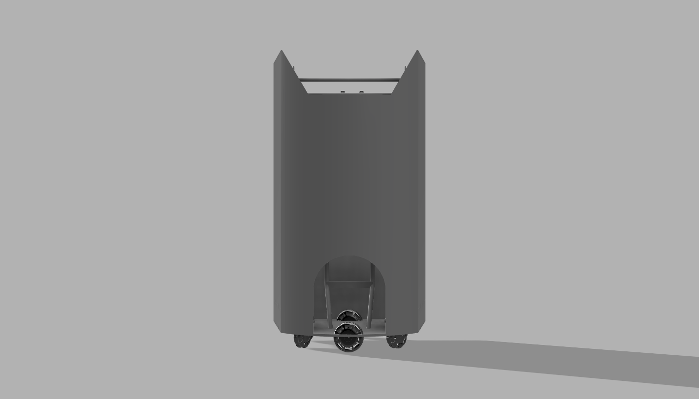
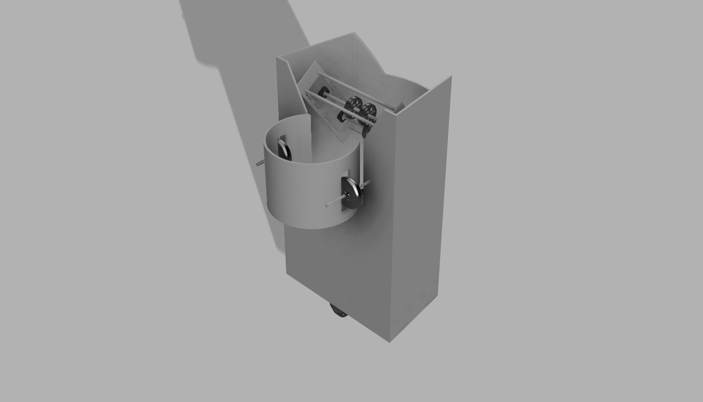
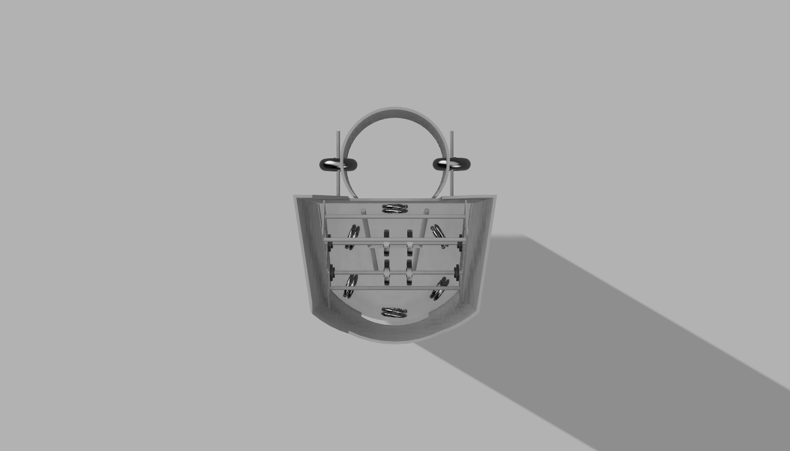
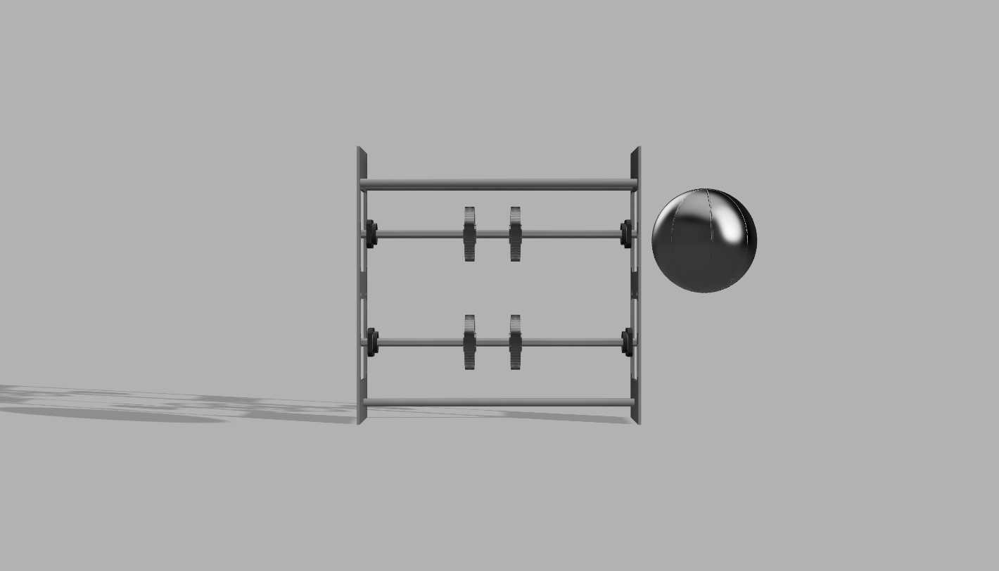
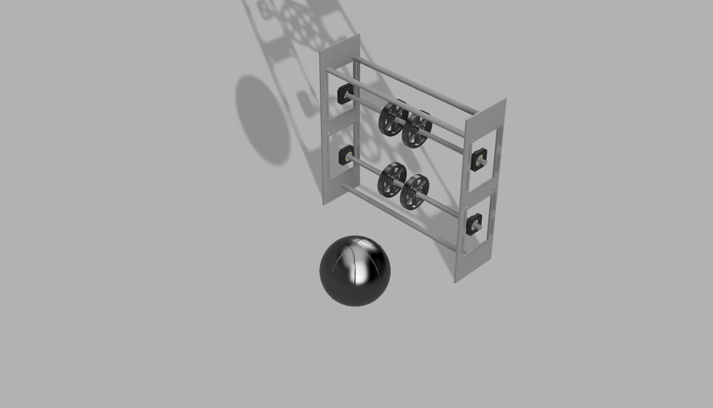
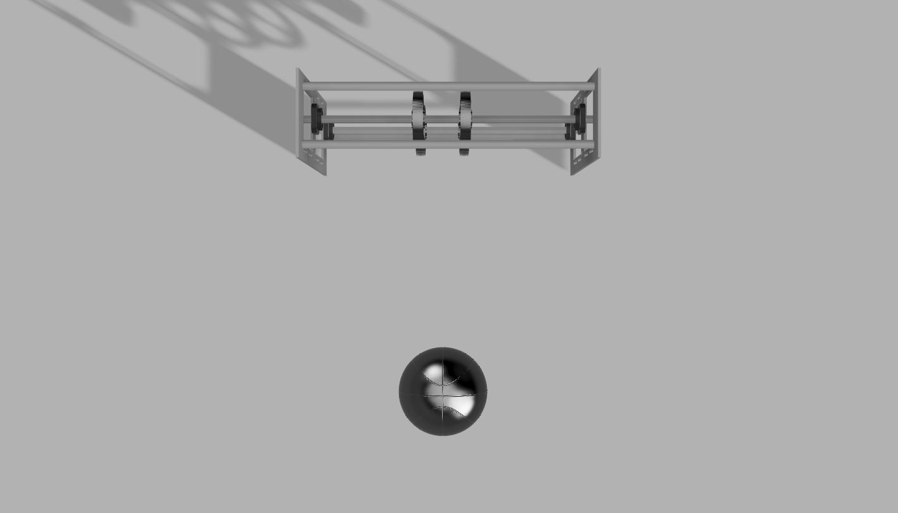

# Robocon 2025 - Robot Design Proposal

## Sister Nivedita University
  
## Project Overview
This repository contains the design details, CAD files, and implementation details for our robots (R1 and R2) participating in Robocon 2025. The robots are designed for agility, precision, and reliability, integrating AI-powered vision systems, advanced ball-handling mechanisms, and robust safety features.

## Robot Specifications
### Overall Dimensions and Weight
- **Weight:** ~15-50 kg
- **Dimensions:**
  - **Starting Height:** 1500mm
  - **Starting Width:** 736mm
  - **Starting Length:** 629mm
  - **Extended Height:** 2400mm

### Drive System
- **Robot-1:** 6-Wheel Omni-Directional Drive
- **Robot-2:** Differential Drive with Linear Actuators
- **Control:** Wireless controller with free-wheel encoders and IMU for accurate localization

### Actuators Integrated
| Actuator | Specifications | Application |
|----------|---------------|-------------|
| DC Motor | 24V, Top Speed: 500 RPM | Wheel movement and dribbling mechanism |
| Servo Motor | 5V, Torque: 10 Kg.cm | Shooting mechanism |
| Pneumatic Pistons | 80mm Stroke, Extend Force: 150N | Jumping mechanism |

### Sensors Integrated
| Sensor | Specifications | Application |
|--------|---------------|-------------|
| Detection Sensors | Various types | Ball and hoop detection |
| IMU | 360-degree scanning, 5m range | Balance during jumps |
| Force Sensor | Force-sensitive resistor | Dribbling feedback |

### Ball Handling and Passing Mechanism
- **Dribbling:** Rubberized rollers with adjustable pressure for consistent ball control
- **Passing:** Catapult or flywheel system for accurate passing

### Dribbling, Jumping, and Shooting Mechanism
- **Dribbling:** Two counter-rotating rollers with force feedback
- **Jumping:** Telescoping legs with pneumatic pistons (vertical leaps up to 2400mm)
- **Shooting:** Adjustable-angle catapult or flywheel system

### Control System
- **Main Controller:** NVIDIA Jetson Nano / Raspberry Pi 4 for AI/vision processing
- **Motor Drivers:** CAN bus / PWM controllers for precise control
- **Pneumatic Valves:** For jumping and dribbling mechanisms

## Key Features
- **Robot-1:** Agile and precise with omni-directional wheels and advanced sensors
- **Robot-2:** Reliable and robust with differential drive and linear actuators
- **AI-powered Vision:** Real-time ball and hoop detection
- **Safety Features:** Emergency stop buttons and collision detection sensors
- **Testing:** Prototypes will undergo rigorous competition-condition testing

## Key Components
- **Funnel Receiver:** Wide opening for easy ball intake
- **Detection Sensors:** Mounted near the top for vision and navigation
- **Dribbling Rollers:** Horizontal rollers with force sensors
- **Articulated Grippers:** Silicone grippers for ball pickup
- **Conveyor Belt:** Motorized belt for ball transport
- **Shooting Mechanism:** Flywheel system with adjustable angle
- **Telescoping Legs:** Pneumatic pistons for jumping
- **Omni-Directional Wheels:** Six wheels for smooth movement
- **Battery & Control Unit:** Positioned at the rear

## CAD Images
### Chassis Views




### Shooter Views




## Repository and Additional Resources
- **GitHub Repository:** [Robocon-2025](https://github.com/Mouli51ch/Robocon-2025)
- **CAD Files & Source Code:** Available in the repository
- **Explanation Video:** [Google Drive](https://drive.google.com/drive/folders/1NGXzD2RY2YW5PxN41SipGCi0Jzv5619P?usp=sharing)

## How to Use
1. Clone the repository:
   ```sh
   git clone https://github.com/Mouli51ch/Robocon-2025.git
   ```
2. Access the CAD files for 3D models and schematics
3. Watch the explanation video for an overview of design and implementation
4. Follow the control system documentation to operate the robots


---
For any queries, contact **Jishnu Baruah** at **jsbaruah1@gmail.com**.
